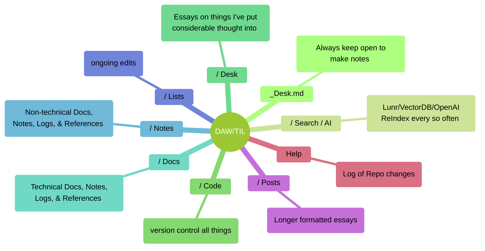
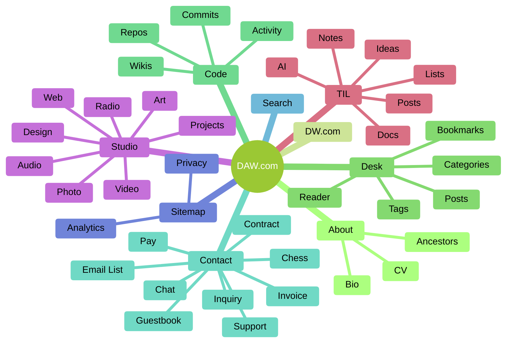

Today I edited an old page on my site because its references had disappeared<sub>1</sub>. I also noticed that my 'now' page<sub>2</sub> was missing a place to note that I make edits somewhat regularly which got me thinking about publishing workflows.

<!--truncate-->

I regularly edit old content and in the case of my docs and notes, I purposefully have the content organized to be continually edited. Over the years, I've noticed that people's tend to just stack more and more. I'm certainly guilty in that I've got half a closet of clothes that I don't wear and I've got a junk drawer in the mud room that's well... full of junk.  It's especially true with computers because your storage isn't exactly noticeable. I've noticed that some folks like to stack files everywhere.

Over time, a file system just kinda worked itself out for me which is mostly based around having a really small number of directories and prefixing them with dates. In August 2012, I tweeted<sub>3</sub>

>#### "my evolving naming convention knows no bounds"

Anytime I move to a new computer, start up a new server, or create a backup disc I always seem to use the same file system because I've likely simplified it as much as I'm able.

import Tabs from '@theme/Tabs';
import TabItem from '@theme/TabItem';

<Tabs>
<TabItem value="computer" label="computer">

```sh title="// computer"
│./
├── User/  
│   ├── Desktop/  
│   │   ├── empty or working files  
│   │   └── _desktop.md - list date y.m.d - Entry
│   ├── Documents/  
│   │   └── categories/ *family/finance/travel/work/etc
│   │   │   └── type/
│   ├── Media/  
│   │   ├── audio/graphics/img/video
│   │   │   ├── y.m_project_name/
│   │   │   │   ├── vendor
│   │   │   │   └── assets/
│   ├── Projects/  
│   │   ├── y.m_project_name/ (change date as updated)
│   │   │   ├── _notes_project_name.md - list date y.m.d - Entry
│   │   │   ├── _log/
│   │   │   ├── assets/
│   │   │   │   └── type/
│   │   │   ├── docs/
│   │   │   └── y.m.d/(achived)
│   ├── Production/  
│   │   ├── project acronym
│   │   │   ├── _notes_project_name.md - list date y.m.d - Entry
│   │   │   ├── assets
│   │   │   │   └── type/
│   │   │   ├── www
│   │   │   │   ├── _log/
│   │   │   │   ├── assets/
└── _notes_computer-name.md  - list date y.m.d - Entry
```

</TabItem>
<TabItem value="disc" label="disc">

```bash title="// disc"
│./
├── Computer/Server_Name/  
│   ├── date y.m.d
│   │   ├── _notes_computer_name.md - list date y.m.d - Entry
│   │   ├── Documents/  
│   │   │   └── categories/ *family/finance/travel/work/etc
│   │   ├── Media/  
│   │   │   ├── audio/graphics/music/photos/video
│   │   │   │   ├── y.m_project_name/
│   │   │   │   │   └── assets/
│   │   │   ├── date y.m.d/
│   │   ├── Projects/  
│   │   │   ├── y.m_project_name/
│   │   │   │   ├── _notes_project_name.md - date list y.m.d - Entry
│   │   │   │   ├── _log/
│   │   │   │   ├── assets/
│   │   │   │   ├── docs/
│   │   │   │   │   └── type/
│   │   │   │   └── date y.m.d/
│   │   ├── Sites/  
│   │   │   ├── project acronym
│   │   │   │   ├── _notes_project_name.md - date list y.m.d - Entry
│   │   │   │   ├── assets
│   │   │   │   │   └── type/
│   │   │   │   ├── www
│   │   │   │   │   ├── _log/
│   │   │   │   │   └── assets/
│   │   ├── Desktop/  
│   │   │   ├── empty or working files  
│   │   │   └── _desktop.md - list format y.m.d - Entry
└── _notes_disc-name.md  - list format y.m.d - Entry
```

</TabItem>
<TabItem value="server" label="server">

```sh title="// server"
│./
├── ~ home/user
│   ├──  .configs/
│   ├──  _backup/
│   ├── └── date y.m.d:h:m_files/
│   ├──  _logs
│   ├──  _monitor
├── var/www/  
│   ├── domain
│   │   ├── _log/
│   │   ├── _backup/
│   │   │   ├── date y.m.d:h:m_files/
│   │   │   └── date y.m.d:h:m_db.sql/
│   │   ├── _notes_project_name.md
│   │   ├── html/ *nginx/apache
│   │   └── app/ *proxy/port
└── _notes_server-name.md - configuration 
```

</TabItem>
</Tabs>

Part of the reason I can knock these posts out on a whim is that I've learned to try and match my local workflow with my publishing. I've started using the same techniques I use for software documentation on things like our house, finances, groceries, or pets because a digital version is the same as the old file cabinet. I've noticed that as I keep documents for a good length of time, I inevitably add items like a `Table of Contents` and `Log` because they become more important in being able to **quickly** understand large documents. I like the 'Log' up top so I don't have to scroll and the markup starts to look like this 👇🏼 for almost every document.


```md title="// docs/notes/lists"
# Title
(y.m.d) - quick summary and reason created

## Log
(y.m.d) - what changed

### Source
  - if subject has major reference

## Content

#### Intro

#### Body
  - concise in docs and notes
    - colorful in an essay
  - outlines and lists
  - meaningful searchable heading titles
  - name embedded assets `title_type.ext`

#### Conclusion

---
## References
  - titles and full URLs for external links
    - relative URL for sub-domain/directory
  - citation style is inconsistent
---

### Notes
  - recent related
  - additional resources
```

##### Notes/Docs structure



I've noticed that any website I publish with a content management system will generally get 'away' from the editors over time. Editors like to focus on whatever is new and sometimes fail to recognize the importance of trimming or editing the old content<sub>4</sub>. This can be problematic when you have outdated pages published that haven't been updated or removed. It's especially important given that visitors are not usually navigating from the front page and are coming in from a search leading them directly to the outdated content. I've seen it over and over again where a site architecture changes and leaves behind a couple hundred third-tier pages of outdated information. I've had plenty of projects where they just wipe it clean and start fresh. The whole of the web suffers from this and I'm just trying to keep my little section of it tidy.


##### Website structure



I always find myself on in `delete` mode before the new year. I equate it to the **subtractive process** in art or engineering. When someone new to painting they tend to overload the pallette and blob paint on until the colors are muddy. The key is having a really simple pallette that can be wiped clean, restarted, and managed easily. It's no different in web publishing or software engineering. You just need an easy way of reviewing of all of your code or content and keeping your architecture simple. Organizing information or code is pretty tough<sub>5</sub> and even though it's really all preference, having organizing principles kinda helps as guide<sub>6</sub>.

---

1. _Sam Doyle_ - https://davidawindham.com/sam-doyle/
2. NOW - [https://davidawindham.com/now](https://davidawindham.com/now)
3. TIL/lists/Tweets - [/lists/tweets#2012](/lists/tweets#2012)
4. _Non_linear Publishing_ - https://davidawindham.com/non-linear-publishing/
5. TIL/notes/references - [/notes/#references](/notes/#references)
6. Organizing Principle - https://en.wikipedia.org/wiki/Organizing_principle
