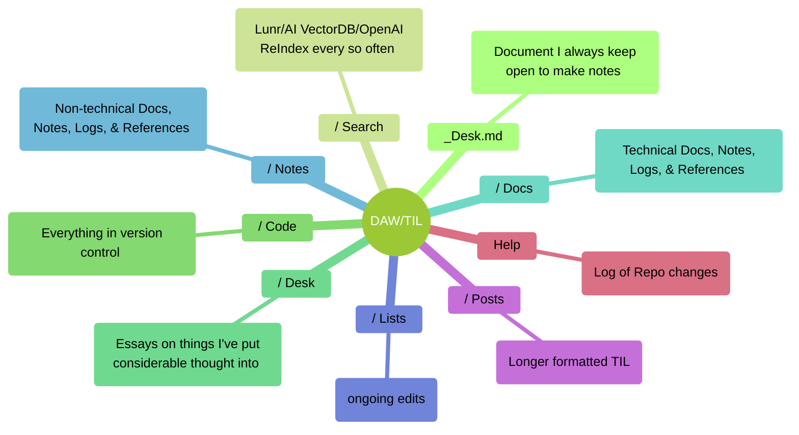
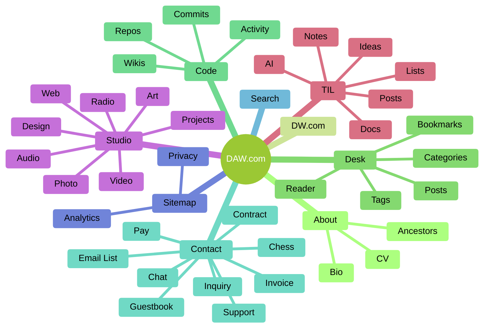

Today I noticed that my 'now' page<sub>1</sub> was missing a place to note something I do regularly which got me to thinking about publishing workflows and making it really easy to keep updated. I regularly edit old content and in the case of my docs and notes, I purposefully have the content organized to be continually edited.

<!--truncate-->

Over the years, I've noticed that people's tendency is to just stack more and more. I'm certainly guilty in that I've got half a closet of clothes that I don't wear and I've got a junk drawer in the mud room that's well... full of junk.  It's especially true with computers because your storage isn't exactly noticeable. Although I've ever worked in a 'desktop support' sorta capacity, I've had enough support experience to know that folks just stack files everywhere.

I've also noticed that any website I publish with a content management system will generally get 'away' from the editors over time. I've got a couple that have thousands of pages of content and what happens is that the publishers and/or editors will continue to focus on whatever is new is happening and fail to recognize the importance of trimming or editing the old content. This can be really problematic when your staff, customers, or clients are citing pages published that haven't been updated or removed. It's especially important given that visitors are not usually navigating from the front page and instead from a search leading them directly to something outdated. I've seen it over and over again where a site architecture changes and leaves behind a couple hundred third-tier pages of outdated information.

I equate it to art where you have an additive **and** subtractive process. And just like with painting, folks just tend to blob paint on until the colors are muddy. And just like painting, the key is having a really simple pallette that can be wiped clean, restarted, and managed easily. In web publishing this means to having an easy way to review of all of your content and trying to keep your information architecture very simple. I think part of this is thinking about publishing linearly like the print days and I try to refer to the web as a 'living document' anytime I'm in a meeting. Organizing information well is actually pretty tough<sub>2</sub>. 

I've learned to try an match my local workflow with my publishing and I've started using the same techniques I use for software documentation on things like our house, finances, groceries or pets because a digital version is exactly the same as the old file cabinet. I've noticed that as I keep a documents for a length of time, items like a Table of Contents and Log become important in being able to quickly understand them. The folder structure on my computers have started to mirror the publishing structure.

I should note that I did edit two old posts this morning, but I could have had half my closet cleaned out in the the time I spend publishing this.


##### 👇🏼 This is my folder structure on my machines ( sans system directories )

```zsh
├── Desktop/  
│   ├── (emptied daily)  
├── Documents/  
│   ├── _dw/
│   └── car/family/finance/travel/work/etc
├── Media/  
│   ├── graphics/
│   │   └── by vendor/
│   ├── movies/
│   │   └── by vendor/
│   ├── music/
│   ├── photos/
│   │   └── by date/
├── Projects/  
│   ├── project_name/
│   │   ├── _notes_project_name.md
│   │   ├── _notes_project_name_(date).md
│   │   ├── 22.10(month_folders)/
│   │   ├── 19.04/
│   │   ├── assets/
│   │   │   └── type/
│   │   └── docs/
├── Sites/  
│   ├── project acronym
│   ├── daw
│   ├── daw_til
│   │   ├── docs/
│   │   ├── lists/
│   │   ├── posts/
└── _desktop.md  
```

##### 👇🏼 Notes/Docs structure




##### Site structure 👇🏼



---

1. **NOW** - [https://davidawindham.com/now](https://davidawindham.com/now)
2. **TIL**/notes/references - [/notes/#references](/notes/#references)
3. _Non_linear Publishing_ - https://davidawindham.com/non-linear-publishing/
