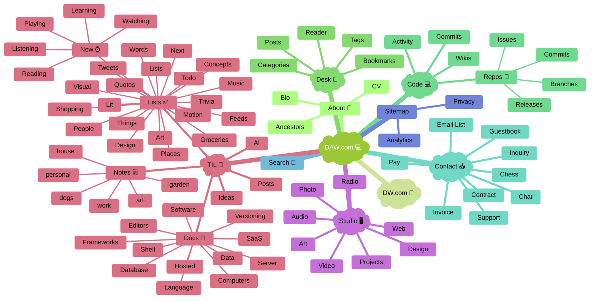

# Map

A clickable version of the top level — nodes link out to each section (the full picture is in the mindmap below).

```mermaid
flowchart LR
  ROOT["DAW.com 🌐"]
  ROOT --> ABOUT["About 📕"]
  ROOT --> DWCOM["DW.com 📘"]
  ROOT --> DESK["Desk 📑"]
  ROOT --> CODE["Code 💻"]
  ROOT --> CONTACT["Contact 📥"]
  ROOT --> SEARCH["Search 🔎"]
  ROOT --> SITEMAP["Sitemap"]
  ROOT --> STUDIO["Studio 🖥️"]
  ROOT --> TIL["TIL 📖"]

  ABOUT --> AB_ANC["Ancestors"]
  ABOUT --> AB_BIO["Bio"]
  ABOUT --> AB_CV["CV"]

  DESK --> DK_BOOK["Bookmarks"]
  DESK --> DK_CAT["Categories"]
  DESK --> DK_POSTS["Posts"]
  DESK --> DK_READ["Reader"]
  DESK --> DK_TAGS["Tags"]

  CODE --> CD_ACT["Activity"]
  CODE --> CD_COMM["Commits"]
  CODE --> CD_REPO["Repos 💾"]
  CODE --> CD_WIKI["Wikis"]
  CD_REPO --> CD_BR["Branches"]
  CD_REPO --> CD_RC["Commits "]
  CD_REPO --> CD_ISS["Issues"]
  CD_REPO --> CD_REL["Releases"]

  CONTACT --> CN_CHAT["Chat"]
  CONTACT --> CN_CHESS["Chess"]
  CONTACT --> CN_CON["Contract"]
  CONTACT --> CN_GB["Guestbook"]
  CONTACT --> CN_INQ["Inquiry"]
  CONTACT --> CN_INV["Invoice"]
  CONTACT --> CN_EM["Email List"]
  CONTACT --> CN_PAY["Pay"]
  CONTACT --> CN_SUP["Support"]

  SITEMAP --> SM_AN["Analytics"]
  SITEMAP --> SM_PR["Privacy"]

  STUDIO --> ST_ART["Art"]
  STUDIO --> ST_AUD["Audio"]
  STUDIO --> ST_DES["Design"]
  STUDIO --> ST_PROJ["Projects"]
  STUDIO --> ST_PH["Photo"]
  STUDIO --> ST_RAD["Radio"]
  STUDIO --> ST_VID["Video"]
  STUDIO --> ST_WEB["Web"]

  TIL --> AI["AI 🤖"]
  TIL --> DOCS["Docs 📓"]
  TIL --> IDEAS["Ideas"]
  TIL --> NOTES["Notes 🗒️"]
  TIL --> LISTS["Lists ✅"]
  TIL --> POSTS["Posts ✍️"]
  TIL --> HELP["Help ❓"]

  DOCS --> DC_COMP["Computers"]
  DOCS --> DC_DATA["Data"]
  DOCS --> DC_DB["Database"]
  DOCS --> DC_ED["Editors"]
  DOCS --> DC_FW["Frameworks"]
  DOCS --> DC_LANG["Language"]
  DOCS --> DC_SAAS["SaaS"]
  DOCS --> DC_SRV["Server"]
  DOCS --> DC_HOST["Hosted"]
  DOCS --> DC_SHELL["Shell"]
  DOCS --> DC_SW["Software"]
  DOCS --> DC_VER["Versioning"]

  NOTES --> NT_ART["Art"]
  NOTES --> NT_DOGS["Dogs"]
  NOTES --> NT_GAR["Garden"]
  NOTES --> NT_HOUSE["House"]
  NOTES --> NT_PERS["Personal"]
  NOTES --> NT_WORK["Work"]

  LISTS --> LS_NOW["Now ⌚️"]
  LS_NOW --> LS_LEARN["Learning"]
  LS_NOW --> LS_LISTEN["Listening"]
  LS_NOW --> LS_PLAY["Playing"]
  LS_NOW --> LS_READ["Reading"]
  LS_NOW --> LS_WATCH["Watching"]
  LISTS --> LS_NEXT["Next"]
  LISTS --> LS_TODO["Todo"]
  LISTS --> LS_GROC["Groceries"]
  LISTS --> LS_SHOP["Shopping"]
  LISTS --> LS_ART["Art "]
  LISTS --> LS_LIT["Lit"]
  LISTS --> LS_MOT["Motion"]
  LISTS --> LS_MUS["Music"]
  LISTS --> LS_VIS["Visual"]
  LISTS --> LS_CON["Concepts"]
  LISTS --> LS_DES["Design "]
  LISTS --> LS_FEED["Feeds"]
  LISTS --> LS_LISTS["Lists"]
  LISTS --> LS_PLACES["Places"]
  LISTS --> LS_PEOPLE["People"]
  LISTS --> LS_THINGS["Things"]
  LISTS --> LS_TRIV["Trivia"]
  LISTS --> LS_TWEET["Tweets"]
  LISTS --> LS_QUOT["Quotes"]
  LISTS --> LS_WORDS["Words"]

  click ROOT "https://davidawindham.com" _blank
  click DWCOM "https://davidwindham.com" _blank
  click ABOUT "https://davidawindham.com/about" _blank
  click DESK "https://davidawindham.com/desk" _blank
  click CODE "https://code.davidawindham.com" _blank
  click CONTACT "https://davidawindham.com/contact" _blank
  click STUDIO "https://davidawindham.com/studio" _blank
  click TIL "https://davidawindham.com/til/" _blank

  click AI "https://davidawindham.com/til/ai" _blank
  click DOCS "https://davidawindham.com/til/docs/" _blank
  click NOTES "https://davidawindham.com/til/notes/" _blank
  click LISTS "https://davidawindham.com/til/lists/" _blank
  click POSTS "https://davidawindham.com/til/posts/" _blank
  click HELP "https://davidawindham.com/til/help" _blank

  click DC_COMP "https://davidawindham.com/til/docs/computers/kos" _blank
  click DC_DATA "https://davidawindham.com/til/docs/data/data" _blank
  click DC_DB "https://davidawindham.com/til/docs/db/MongoDB" _blank
  click DC_ED "https://davidawindham.com/til/docs/editors/atom" _blank
  click DC_FW "https://davidawindham.com/til/docs/waf/deno" _blank
  click DC_LANG "https://davidawindham.com/til/docs/lang/Golang" _blank
  click DC_SAAS "https://davidawindham.com/til/docs/saas/akamai" _blank
  click DC_SRV "https://davidawindham.com/til/docs/server/apache" _blank
  click DC_HOST "https://davidawindham.com/til/docs/host/Discourse" _blank
  click DC_SHELL "https://davidawindham.com/til/docs/shell/dotfiles" _blank
  click DC_SW "https://davidawindham.com/til/docs/localhost/macos" _blank
  click DC_VER "https://davidawindham.com/til/docs/editors/git" _blank

  click NT_ART "https://davidawindham.com/til/notes/art/art" _blank
  click NT_DOGS "https://davidawindham.com/til/notes/dogs/dogs" _blank
  click NT_GAR "https://davidawindham.com/til/notes/garden/garden" _blank
  click NT_HOUSE "https://davidawindham.com/til/notes/house/house" _blank
  click NT_WORK "https://davidawindham.com/til/notes/work/work" _blank

  click LS_NOW "https://davidawindham.com/til/lists/now/now" _blank
  click LS_LEARN "https://davidawindham.com/til/lists/now/learning" _blank
  click LS_LISTEN "https://davidawindham.com/til/lists/now/listening" _blank
  click LS_PLAY "https://davidawindham.com/til/lists/now/playing" _blank
  click LS_READ "https://davidawindham.com/til/lists/now/reading" _blank
  click LS_WATCH "https://davidawindham.com/til/lists/now/watching" _blank
  click LS_NEXT "https://davidawindham.com/til/lists/next" _blank
  click LS_TODO "https://davidawindham.com/til/lists/todo" _blank
  click LS_GROC "https://davidawindham.com/til/lists/food/grocery" _blank
  click LS_SHOP "https://davidawindham.com/til/lists/shopping" _blank
  click LS_ART "https://davidawindham.com/til/lists/art/art" _blank
  click LS_LIT "https://davidawindham.com/til/lists/art/lit" _blank
  click LS_MOT "https://davidawindham.com/til/lists/art/motion" _blank
  click LS_MUS "https://davidawindham.com/til/lists/art/music/music" _blank
  click LS_VIS "https://davidawindham.com/til/lists/art/visual" _blank
  click LS_CON "https://davidawindham.com/til/lists/concepts" _blank
  click LS_DES "https://davidawindham.com/til/lists/design" _blank
  click LS_FEED "https://davidawindham.com/til/lists/feeds" _blank
  click LS_LISTS "https://davidawindham.com/til/lists/lists" _blank
  click LS_PLACES "https://davidawindham.com/til/lists/places/places" _blank
  click LS_PEOPLE "https://davidawindham.com/til/lists/people" _blank
  click LS_THINGS "https://davidawindham.com/til/lists/things" _blank
  click LS_TRIV "https://davidawindham.com/til/lists/trivia" _blank
  click LS_TWEET "https://davidawindham.com/til/lists/tweets" _blank
  click LS_QUOT "https://davidawindham.com/til/lists/quotes" _blank
  click LS_WORDS "https://davidawindham.com/til/lists/words" _blank
```

```mermaid
%%{
  init: {
    'theme':'forest'
  }
}%%
mindmap
  root)DAW.com 💻(
    About 📕
      Ancestors
      Bio
      CV
    )DW.com 📘 (
    )Desk 📑(
      Bookmarks
      Categories
      Posts
      Reader
      Tags
    )Code 💻(
      Activity
      Commits
      Repos 💾
        Branches
        Commits
        Issues
        Releases
      Wikis
    )Contact 📥(
      Chat
      Chess
      Contract
      Guestbook
      Inquiry
      Invoice
      Email List
      Pay
      Support
    Search 🔎
    Sitemap
      Analytics
      Privacy
    )Studio 🖥️(
      Art
      Audio
      Design
      Projects
      Photo
      Radio
      Video
      Web
    )TIL 📖(
      AI
      Docs 📓
        Computers
        Data
        Database
        Editors
        Frameworks
        Language
        SaaS
        Server
        Hosted
        Shell
        Software
        Versioning
      Ideas
      Notes 🗒️
        art
        dogs
        garden
        house
        personal
        work
      Lists ✅
        Now ⌚️
          Learning
          Listening
          Playing
          Reading
          Watching
        Next
        Todo
        Groceries
        Shopping
        Art
        Lit
        Motion
        Music
        Visual
        Concepts
        Design
        Feeds
        Lists
        Places
        People
        Things
        Trivia
        Tweets
        Quotes
        Words
      Posts
```