# Map

I need a map because it helps me keep up with the structure of this website.

- About / Ancestors Bio CV
- Code / Activity Commits Repos Issues Wiki
- Contact / Chat Contract Form Guestbook Inquiry Mailing Pay Support
- Invoice / Clients Billing Payments Project Tasks Tickets Quotes
- Desk / Bookmarks Reader Archive Categories Tags Search
- TIL / AI Search Docs Lists Notes Posts Help
- Studio / App Art Broadcast Code Design Media Web Radio Chess
- Sitemap / Analytics Privacy Copyright

```mermaid
%%{
  init: {
    'theme':'forest'
  }
}%%
mindmap
  root)DAW.com(
    About 📕
      Ancestors
      Bio
      CV
    )DW.com 📘 (
    )Desk 📑(
      Bookmarks
      Categories
      Posts
      Reader
      Tags
    )Code 💻(
      Activity
      Commits
      Repos 💾
        Branches
        Commits
        Issues
        Releases
      Wikis
    )Contact 📥(
      Chat
      Chess
      Contract
      Guestbook
      Inquiry
      Invoice
      Email List
      Pay
      Support
    Search 🔎
    Sitemap
      Analytics
      Privacy
    )Studio 🖥️(
      Art
      Audio
      Design
      Projects
      Photo
      Radio
      Video
      Web
    )TIL 📖(
      AI
      Docs 📓
        Computers
        Data
        Database
        Editors
        Frameworks
        Language
        SaaS
        Server
        Hosted
        Shell
        Software
        Versioning
      Ideas
      Notes
        art
        dogs
        garden
        house
        personal
        work
      Lists
        Now
          Learning
          Listening
          Playing
          Reading
          Watching
        Next
        Todo
        Groceries
        Shopping
        Art
        Lit
        Motion
        Music
        Visual
        Concepts
        Design
        Feeds
        Lists
        Places
        People
        Things
        Trivia
        Tweets
        Quotes
        Words
      Posts
```

