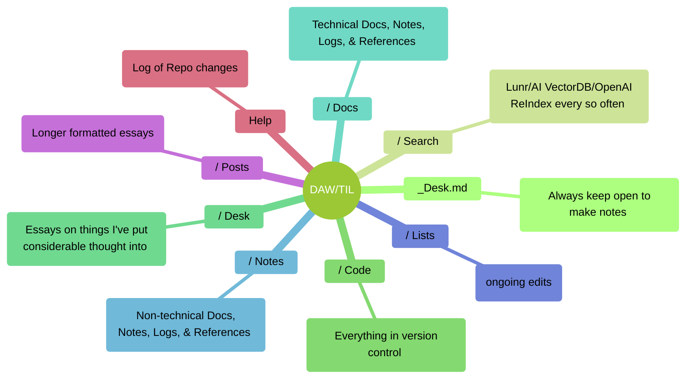
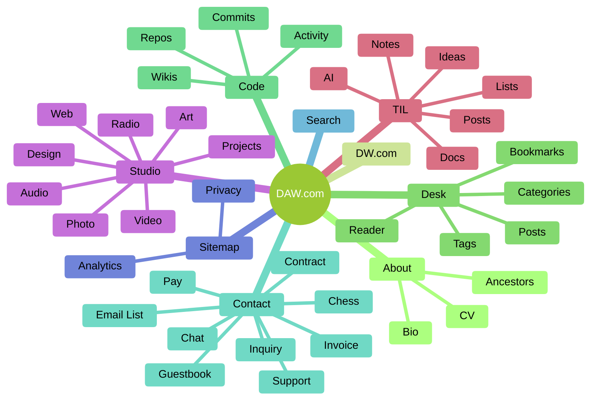

# Sitemap

##### Notes/Docs structure

##### Website structure

- [About](https://davidawindham.com/about/)
  - Bio
  - CV
- Code
  - Activity
  - Repos
    - Branches
    - Commits
    - Issues
    - Releases
    - Requests
    - Wikis
- Contact
  - Chat
  - Chess
  - Contract
  - Form
    - Contact
    - Guestbook
    - Inquiry
    - Mailing List
    - Pay
      - Shop
      - Checkout
    - Support
  - Invoice
    - Clients
    - Project
    - Tasks
    - Quotes
  - Radio
  - RTC
- Desk
  - Bookmarks
    - Tags
    - Daily
  - Reader
    - Subscriptions
    - Tags
  - Post
    - Archive
    - Tags
    - Categories
  - Search
  - TIL
    - About
    - AI
      - Search
      - Ask
    - Docs
      - Computers
      - Data
      - Database
      - Editors
      - Frameworks
      - Language
      - SaaS
      - Server
      - Hosted
      - Shell
      - Software
      - Versioning
      - Lists
        - Art
          - Lit
          - Motion
          - Music
          - Visual
        - Concepts
        - Design
        - Feeds
        - Groceries
        - Next
        - Now
          - Learning
          - Listening
          - Playing
          - Reading
          - Watching
        - Lists
        - Places
        - People
        - Shopping
        - Things
        - Todo
        - Todone
        - Trivia
        - Tweets
          - Archive
          - Followed
        - Quotes
        - Words
      - Notes
        - Art
        - Dogs
        - Garden
        - Mushrooms
        - Golf
        - Health
        - House
        - Tennis
        - Travel
        - Work
          - Clients
          - Design
          - Projects
            - AI
            - Game
            - GZET
            - Ham
            - Juryd
            - Pants
            -ZW
          - Wealth
    - Posts
      - Tags
      - Date
    - Help
      - Log
    - Search
- Now
  - Learning
  - Listening
  - Playing 
  - Reading
  - Watching
- Studio
  - Art
    - Media
    - Oil
    - Photo
    - Watercolor
  - Audio
    - Music
    - Talk
  - Broadcast
    - Ham
    - Show
    - Radio
  - Code
    - App
    - Architect
    - Integration
    - Software
    - Web
  - Design
    - Illustration
    - Graphic
    - Print
    - UX
  - Photo
  - Video
  - Web
- Sitemap
  - Analytics
  - Privacy
  - Copyright